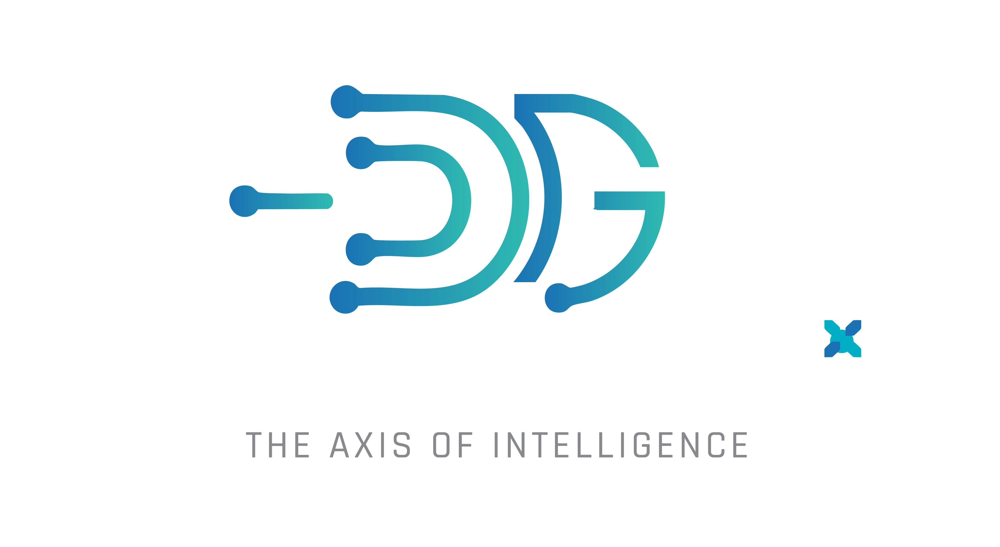

<div class="brand"></div>

# Perkins Roofing — Video Intelligence & Content Growth Platform

**Prepared for:** Tim, Perkins Roofing &nbsp;|&nbsp; **Prepared by:** DeGenito.AI &nbsp;|&nbsp; **Date:** June 9, 2026
**Channel:** [youtube.com/@perkinsroofingcorp](https://www.youtube.com/@perkinsroofingcorp) &nbsp;·&nbsp; **832 videos** (176 long-form + 648 Shorts) &nbsp;·&nbsp; **~60 hours** &nbsp;·&nbsp; 3.2K subscribers

---

## 1. The Big Idea

You've already done the hard part: you've built a YouTube channel that generates real,
organic roofing leads. Every video you've recorded is a sales conversation, an objection
handled, a homeowner's question answered — but right now all of that knowledge is locked
inside **832 videos (about 60 hours)** of footage — 176 long-form deep-dives plus 648 Shorts —
that nobody can search, reuse, or measure.

**We turn your entire video library into a living, searchable knowledge engine — then point
that engine at one goal: more qualified roofing leads, across YouTube, Facebook, Instagram,
and TikTok.**

Three things working together:

- **A brain** — every word you've ever said on camera, transcribed, timestamped, and
  organized into a structured knowledge base you can ask questions of.
- **A megaphone** — that knowledge automatically repurposed into content, ads, FAQs, and
  replies that reach more of the right people on every platform.
- **A scoreboard** — measurable proof of what's working: which topics drive leads, what's
  worth boosting with ad dollars, and where the best return is.

> **Headline promise:** *Record once. Get found everywhere. Turn your video library into a
> measurable lead engine.*

---

## 2. How It Works

```
   Your YouTube channel
          │
          ▼
   [1] Auto-detect new videos  ──►  [2] Download video + audio  ──►  [3] Transcribe
          │   (all inside YOUR cloud account)                        sentences + every word,
          │                                                          with timestamps & confidence
          ▼
   [4] Understand the content  ──►  Build the "Content Graph"
          │                         (topics, materials, questions answered, objections,
          │                          claims, calls-to-action — each linked to the exact
          │                          second in the video where you said it)
          ▼
   [5] Ask it anything         ──►  "Show all videos that talk about clay tiles"
          │                         → a list of links that jump to the exact moment
          ▼
   [6] Put it to work          ──►  FAQs · social content · ads · website assistant ·
                                     competitor intelligence · engagement · reporting
```

Every answer the system gives is **grounded in something you actually said** and links
straight to the timestamp in the real video — no made-up claims, no guessing. That keeps
your brand safe and your expertise authentic.

> **Bonus you get on day one — a complete backup of your library.** To do all this, we
> download your full video catalog (video, not just audio) into a private cloud storage
> bucket in your own account that's yours to access anytime. Right now YouTube is your only
> copy and you've already lost some files locally — this gives you a durable, owned archive
> of all 832 of your videos (~60 hours), yours to keep.

---

## 3. The "Content Graph" — Why This Is Different

Most "AI on your videos" tools just do fuzzy search and sometimes make things up. We build
something sturdier. On top of the raw transcripts we build a **structured knowledge layer** —
a factual index of:

- **Topics & materials** (clay tile, synthetic underlayment, ice dams, TPO, storm damage…)
- **Questions you've answered** and where
- **Objections you've handled** and your exact rebuttal
- **Claims & recommendations** you've made (so the AI never invents advice you didn't give)
- **Calls-to-action** and the moments that drive engagement

Searches hit this exact index first, then use AI semantic search to catch paraphrases
("Spanish tile" → "clay tile"). The result: **fast, accurate, citeable answers that always
link to the real video at the right second.**

---

## 4. Twenty Ways This Drives Leads & Growth

Grouped by the three pillars. (★ = you specifically asked for it.)

### Pillar A — Lead Generation (the north star)

1. **"Ask Tim" website assistant** — a chatbot on your site that answers homeowner questions
   in *your own words*, cites your videos, and captures the lead. Your best salesperson, 24/7.
2. **Auto-generated FAQ bank (500+ Q&As)** ★ — every question a homeowner might ask, answered
   from your content and linked to the source clip. Powers the website, chatbot, and sales.
3. **Sales-enablement clips** — when a lead has a specific worry, instantly pull the exact
   video moment where you address it and send it. Shortens the sale, builds trust.
4. **Lead capture & attribution** — track which videos/topics actually drive site visits and
   form fills, so we know what's earning its keep.
5. **Objection & concern library** — every objection you handle on camera, turned into sales
   scripts and targeted content that closes the gap before a homeowner even calls.
6. **Buying-intent comment detection** — flag commenters asking purchase-ready questions
   ("how much for a 2,000 sq ft replacement?") as warm leads to engage directly.

### Pillar B — Reach & Authority

7. **Semantic timecoded search** ★ — "show all videos that talk about clay tiles" → links that
   jump to the exact moments. The foundation everything else is built on.
8. **"What's most engaging" analytics** ★ — rank topics and moments by views, like rate,
   comment rate, sentiment, and view velocity. Know what resonates, do more of it.
9. **Competitor content & comment intelligence** ★ — study competitor channels, find the gaps
   you can own, and learn what their audience is begging to know.
10. **Engagement queue** ★ — drafted, on-brand replies on relevant/competitor videos that cite
    your content with a timestamped link ("Tim at Perkins covers exactly this here…"). Every
    reply is human-approved (details in §6).
11. **Trend & breakout detection** — alerts when a video starts taking off, so we boost it and
    film a follow-up while it's hot.
12. **Share-of-voice dashboard** — track your presence vs. competitors over time. Become *the*
    trusted roofing voice in your market.

### Pillar C — Content Leverage (10× more from what you already record)

13. **Social content idea generator** ★ — fresh, data-backed post ideas from your top themes
    and from real audience questions.
14. **Automated clip factory** — auto-identify the most clippable 30–60s moments, then
    *automatically render* each one: reframe to vertical, burn captions, **prepend a branded
    title screen**, and **append a few-second outro "bump"** promoting your channel and socials.
    Out comes a finished, on-brand short with zero manual editing. (Can also connect to your
    existing OpusClip account if you upgrade to its API plan — but we don't require it.)
15. **Multi-platform cascade** — publish the best content to your own Facebook, Instagram,
    TikTok, and YouTube accounts via the official scheduling APIs (the same way Hootsuite or
    Buffer works), tailored per platform. Your content, your accounts — fully legitimate.
16. **SEO blog engine** — long-form, genuinely useful blog posts from your transcripts (strong
    credibility because it's real expertise) → organic search leads with embedded videos.
17. **Educational series builder** ★ — structure your content into consumer trust-building
    series ("The Homeowner's Guide to Roof Replacement"), reusing existing clips and giving
    you a shot-list of episodes still to film.
18. **Email / newsletter content** — a monthly homeowner-tips digest, assembled for you.
19. **Brand-voice corpus** — a "Tim voice" so every AI-assisted ad, post, reply, and blog
    sounds like you and never invents claims you didn't make.
20. **Monthly performance report** — one clear scoreboard: leads, reach, share of voice,
    content output, and cost-per-lead. Proof of value, every month.

*(Bonus, beyond the 20: Google review responses, auto-generated SEO video chapters &
descriptions, and title/thumbnail suggestions from what's already working.)*

---

## 5. Paid Ads — Where to Get the Best Bang for Buck

**Core principle: never boost cold. Boost proven winners.** The system already tells us which
organic content resonates (#8) — we put paid dollars *behind content YouTube's algorithm has
already validated.* That's the single biggest ROI lever in paid social.

Spend priority (highest return first):

1. **Retargeting (warm audiences)** across YouTube + Meta — people who already visited your
   site or watched your videos. The cheapest leads you'll ever buy.
2. **Meta (FB/IG) local + lookalike audiences** — best-in-class local targeting and lead-form
   units for home improvement. Most measurable cost-per-lead.
3. **YouTube boosting of proven educational winners** — authority + mid-funnel; reinforces
   your existing organic strength.
4. **TikTok / Reels** — cheapest raw reach; run **organic-first** and only put paid behind a
   clip *after* it proves traction.

**Method:** small test budgets across proven winners → measure cost-per-qualified-lead weekly
→ double down on winners, cut losers → always-on retargeting + a rotating set of boosted
winners, geo-fenced to your service area. We manage this and report on it.

Suggested starting ad budget: **$1,000–$1,500/mo** (separate from our fee), scaled up only as
the return proves out.

---

## 6. The Engagement Program

Two distinct parts. The first is standard and safe; the second is powerful but optional, and
you decide whether to switch it on.

### Part A — Publishing your own content (always on, zero risk)

Posting your own videos and clips to your own Facebook, Instagram, TikTok, and YouTube
accounts through the official publishing APIs. This is exactly what Hootsuite, Buffer, and
OpusClip's scheduler do — your content, your accounts, fully within platform rules.

### Part B — Competitor-comment engagement (optional, you opt in)

Engaging in competitor and relevant comment sections — agreeing, respectfully disagreeing, and
pointing viewers to your content with a timestamped link ("Tim at Perkins covers exactly this
here…"). Done well this is powerful, authentic thought-leadership.

- **Always you, always honest** — every reply is from Perkins Roofing's real account, your
  real opinion, citing your real videos. No fake accounts, no impersonation, no deception.
- **Human-approved** — the system *drafts* opportunities and replies; nothing posts without
  your sign-off, and you can release the whole approved queue to drip out at a natural pace.
- **Straight talk on the risk:** YouTube's terms discourage automated commenting. We minimize
  exposure with human approval, authentic content, conservative volumes, and human-paced
  posting — but this feature carries real platform risk, so **it ships switched OFF and is
  only enabled with your written go-ahead.** We'll give you our honest read and let you decide.

---

## 7. Timeline

A phased rollout — prove each phase before committing to the next.

**Phase 1 — Core platform (Weeks 1–3):**
- Your full library downloaded, backed up, transcribed (sentence + word-level, timestamped)
- The Content Graph + semantic search with timecoded deep-links
- Grounded "Ask Tim" + status dashboard, deployed in your own cloud — with a live demo to you

**Phase 2 — Feature build-out (next 30–60 days, optional):**
- FAQ bank + "Ask Tim" live on your website
- Automated clip factory + multi-platform cascade
- Engagement & ad-boost analytics + competitor intelligence
- SEO blog engine + educational series + performance reporting

**Ongoing — Support, tuning & strategy (optional):**
- Monitoring, tuning, new-content processing, and strategy — on a support plan or hourly

---

## 8. Investment

A phased path — you own each phase as it's delivered, and you only commit to the next once
you've seen the last one work. No long-term contract.

**$8,600** Phase 1 — core platform (one-time)<br>**$2,500/mo × 2** Phase 2 — feature build-out (optional)<br>**$1,000/mo** support & strategy — 5 hrs, or $200/hr (optional)
{: .pricebox }

*Plus your own Google Cloud usage (~$150–300/mo, paid directly to Google — no markup from us)
and any ad spend (your budget).*

### Phase 1 — Core platform · **$8,600 one-time** (live in ~3 weeks)

Stands up your platform in **your own Google Cloud account** — you own the infrastructure,
the data, and the accounts.

- **Full media archive & backup** of all 832 videos — durable, owned, yours to access
- **Auto-ingest + transcription** of your library — sentence + word-level, timestamped
- **The Content Graph** — your searchable, citeable knowledge layer (the engine)
- **Semantic timecoded search** + status dashboard
- **Grounded "Ask Tim" assistant** — answers in your words, with citations, that knows when to
  say "I couldn't find that" rather than guess
- **Deployed in your own Google Cloud account**

### Phase 2 — Feature build-out · **$2,500/mo for 2 months** (optional, 30–60 days after Phase 1)

This is **development capital, not a subscription** — we build these features *into* your
platform over 30–60 days. After the two months they're yours, running, with no ongoing build
fee. Begin only if Phase 1 has earned it.

- **FAQ bank (500+)** for your website
- **Automated clip factory** — branded title screen + promo outro bump
- **Multi-platform cascade** to YouTube, Facebook, Instagram & TikTok
- **Sales-enablement clips** + **objection library**
- **Lead capture & attribution**
- **Engagement & "what's working" analytics** + trend/breakout alerts
- **Paid-ad boost optimization**
- **Competitor content & comment intelligence**
- **Competitor-comment engagement program** (opt-in; off until you say go)
- **SEO blog engine** + **educational series builder**
- **Performance reporting**

### Support, tuning & strategy (optional, ongoing)

Once it's built, keep it sharp — your choice:

- **$1,000/mo** for **5 hours** of support, tuning, and strategy, **or**
- **billed hourly at $200/hr**, as needed

Covers monitoring, model/prompt tuning, new-content processing, campaign guidance, and a
monthly strategy check-in.

### Your cloud & other costs — transparent, no markup

- **Runs in your own Google Cloud account** — you pay Google directly, ~**$150–300/mo** at this scale.
- **One-time back-catalog processing:** 832 videos (~60h) ≈ **$60–120** (or near-zero on a
  temporary cloud GPU). You approve the batch before we run it.
- **Paid ad spend:** separate, your budget, recommended start **$1,000–1,500/mo**.

---

## 9. How We Build It (Technical Approach)

For the technically curious — here's what's under the hood. The whole system runs in **your
own cloud account**, so you're never locked to us and you own everything.

```
                    ┌──────────────── YOUR Google Cloud account ────────────────┐
  Scheduler ──────► │  Watcher: checks your channel for new uploads              │
                    │      │                                                     │
                    │      ▼                                                     │
                    │  Ingest: downloads full video + audio ─► your private      │
                    │      │                                    storage bucket   │
                    │      ▼                                                     │
                    │  Transcribe (cloud): sentences + words + confidence        │
                    │      │   (managed speech-to-text; large back-catalogs can  │
                    │      ▼    run on a temporary cloud GPU to cut cost)         │
                    │  Understand → Content Graph (topics/claims/objections/CTAs  │
                    │      │                         linked to exact timecodes)   │
                    │      ▼                                                     │
                    │  Index for search (semantic + keyword) in your database     │
                    │      │                                                     │
                    │      ▼                                                     │
                    │  Secure API  ─►  Dashboard · "Ask Tim" widget · Clip       │
                    │                  factory · Publisher · Reports             │
                    └────────────────────────────────────────────────────────────┘
```

**The building blocks (all managed cloud services in your account):**

- **Storage** — a private bucket holds your full video archive and audio; recent files stay
  instantly available, older files move to low-cost archival storage automatically.
- **Database** — a managed Postgres database holds your transcripts, the Content Graph, and
  the search index (vector + keyword) together in one secure, queryable place.
- **Transcription** — managed cloud speech-to-text gives sentence- and word-level timestamps
  with confidence scores; large one-time back-catalog runs can use a temporary cloud GPU to
  minimize cost.
- **Understanding & search** — cloud AI models extract the Content Graph and power the grounded
  question-answering, always citing the source video and timecode.
- **Clip factory** — assembles finished vertical clips (reframe, captions, your title card,
  your outro bump) automatically.
- **Publisher** — posts your content to your connected social accounts via each platform's
  official API.

**What this means for you:**

- **You own it all.** Infrastructure, data, transcripts, archive, and accounts live in your
  cloud — you can export or delete anything, anytime. We build and operate; we don't hold your
  data hostage.
- **Your costs are transparent.** Cloud usage is billed by Google directly to you, no markup.
- **It scales with you.** New videos are processed automatically as you publish them.

---

## 10. Diligence & Compliance

We validated this plan against current platform terms and ran the technical approach through
independent review before proposing it:

- **Your own content, your own accounts** — downloading, archiving, transcribing, and
  publishing your videos is fully within your rights.
- **Competitor research is read-only** — we analyze public information only; we do **not**
  download or store competitor videos.
- **Platform-compliant publishing** — your multi-platform posting uses each platform's
  official APIs (the Hootsuite/Buffer model).
- **The one risk, disclosed and optional** — automated commenting on others' videos is the
  only piece that touches platform terms. It ships **off**, requires your **written
  go-ahead**, and is always your authentic, attributed content. You make the call with full
  information.
- **Data handled responsibly** — we store the minimum needed, keep derived analysis rather
  than bulk third-party data, and honor refresh/deletion requirements.

---

## 11. What We Need From You

- *(We already have your channel —* [youtube.com/@perkinsroofingcorp](https://www.youtube.com/@perkinsroofingcorp), *ID `UChJZpBYXOuR0j1EHJugv5hg`, 832 videos. Just confirm it's correct.)*
- **Sign-off on how many videos to process** — we'll confirm your library size and you approve
  the batch (and any later expansions) before we run anything
- Access to set up a Google Cloud account in your name (we handle the configuration)
- Brand basics: logo, colors, tone preferences for generated content and clip title/outro
- A 30-minute kickoff to align on your top topics, service area, and competitors to watch
- *(If you choose the opt-in competitor-comment program)* your written go-ahead
- *(Later/optional)* read-only YouTube Analytics access to unlock deeper insights

---

## 12. Why Us

We build production AI systems for a living. You get an enterprise-grade content-intelligence
platform — running in your own cloud, owned by you — at small-business pricing, operated as a
service so you can keep doing what you do best: roofing and recording.

**Next step:** approve the package, send your channel ID, and we'll have your library
searchable within three weeks.
