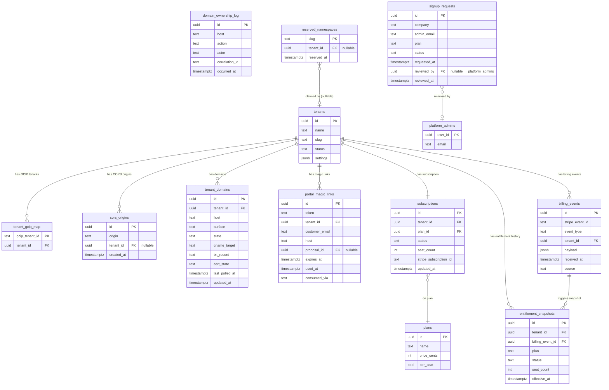

# Ez-Bids — Data / Domain Design Document

**STATUS: SYNCED TO COUNCIL-REVISED PLAN — 2026-07-10.**
Derived from: `ralplan-ezbids-multitenant-DRAFT.md` (council-revised, APPROVED) and `docs/superpowers/specs/ezbids/COUNCIL-REVIEW.md` (Grok-4 + GPT-5, all 10 findings absorbed). All decisions below are final; do not relitigate.

---

## 1. Existing Tables (Reused, Verified 2026-07-10)

The following tables are the foundation Ez-Bids builds on. They are not net-new.

### 1.1 `tenants` (existing, RLS-forced owner table)

The platform tenant record. Every RLS-enforced table carries a `tenant_id` FK referencing this. The `settings` JSONB column (`app/models.py:44`) holds all per-tenant configuration sub-keys; `core/tenant_settings.py` is the read layer. Ez-Bids extends this column with sub-keys rather than adding new tables where the data is simple and non-pollable.

Key existing fields: `id UUID PK`, `name TEXT`, `slug TEXT UNIQUE`, `status TEXT CHECK IN ('active','past_due','suspended')`, `settings JSONB`.

New sub-keys added by Ez-Bids waves (all under `settings`):

| Sub-key path | Wave | Purpose |
|---|---|---|
| `settings.integrations.wp_url` | W0 | Moved from env; tenant 1 only initially |
| `settings.integrations.yt_owner_channel_id` | W0 | Moved from env; tenant 1 only initially |
| `settings.integrations.workspace_admin_subject` | W0 | Moved from env; tenant 1 only initially |
| `settings.brand.email_html_header` | W3 | Per-tenant email header HTML (was platform_config) |
| `settings.brand.from_name` | W3 | Per-tenant display name used in `from` field (e.g. "Acme Roofing") — sender address itself is the platform domain (J-1) |
| `settings.brand.reply_to` | W3 | Per-tenant reply-to address (e.g. info@tenantdomain.com) — NOT the sender domain, which is platform-controlled in v1 (J-1) |
| `settings.domains` | W2 | Lightweight domain state cache (source of truth is `tenant_domains`) |

### 1.2 `tenant_gcip_map` (existing, platform-scoped)

Maps GCIP tenant id (the `firebase.tenant` claim in the ID token) to a platform tenant `id`. Used by `_resolve_tenant` (`api/auth.py:51`). No RLS tenant filter — readable by the platform session to perform the resolution before a tenant session is established.

Key fields: `gcip_tenant_id TEXT PK`, `tenant_id UUID FK → tenants(id)`.

### 1.3 `platform_admins` (existing, platform-scoped)

Holds the set of users who have platform-admin authority (Jon, Tim). Checked by `require_internal_tenants` (`api/auth.py:352`). Not RLS-filtered; checked on a platform session before impersonation.

### 1.4 `platform_config` (existing, platform-scoped)

Key-value platform configuration (`app/models.py:212`, `PlatformConfig`). Ez-Bids moves email branding from here to `Tenant.settings.brand` in W3. The `platform_config` table itself remains for genuinely platform-wide settings.

### 1.5 Proposal and customer-facing tables (existing, RLS-forced)

`proposals`, `proposal_events`, `measurements`, `documents`, and the accept-token RLS policy (migration 0022) are all reused directly by the customer portal (W4). The `_token_scoped_session` pattern (`api/routes/proposals.py:93`) is the established seam; magic-link auth (W4) follows the same pattern.

---

## 2. New Tables (Ez-Bids Net-New, W0–W6)

### 2.1 `cors_origins` — W0 (migration 0026)

Replaces the static `CORS_ORIGINS` env tuple. Read at every request by the dynamic CORS middleware.

```sql
CREATE TABLE cors_origins (
    id          UUID PRIMARY KEY DEFAULT gen_random_uuid(),
    origin      TEXT NOT NULL,          -- e.g. https://app.example.com
    tenant_id   UUID REFERENCES tenants(id) ON DELETE CASCADE NULLABLE,
                                        -- NULL = platform-wide origin
    created_at  TIMESTAMPTZ NOT NULL DEFAULT now()
);
CREATE UNIQUE INDEX cors_origins_origin_uidx ON cors_origins(origin);
```

**RLS posture:** platform-scoped table (no tenant GUC filter). The dynamic CORS middleware runs before tenant resolution — it must read from a platform session. RLS policy: readable by platform session; writable only by platform-admin actions. Tenant-scoped origins are inserted automatically by the domain onboarding flow (W2) when a domain reaches `live`, and are deleted by `core/offboard.py`.

**Ownership distinction:** unlike `authorized_domains` (a TF-managed GCIP attribute with a single runtime owner and `ignore_changes`), `cors_origins` is a pure app table with no TF resource attribute — runtime writes are zero-drift by construction.

---

### 2.2 `tenant_domains` — W2 (migration 0027)

Pollable, indexable source of truth for the domain lifecycle state machine. Preferred over storing state in `Tenant.settings.domains` JSONB because per-domain state needs to be queryable (e.g., "find all domains in `cert_pending` older than N hours for the health-check alert").

```sql
CREATE TABLE tenant_domains (
    id              UUID PRIMARY KEY DEFAULT gen_random_uuid(),
    tenant_id       UUID NOT NULL REFERENCES tenants(id) ON DELETE CASCADE,
    host            TEXT NOT NULL,      -- e.g. app.example.com
    surface         TEXT NOT NULL CHECK (surface IN ('app', 'quote')),
    state           TEXT NOT NULL CHECK (state IN (
                        'control_pending', 'control_verified',   -- proof-of-control stages (council #6)
                        'requested', 'dns_pending', 'cert_pending', 'live', 'failed'
                    )) DEFAULT 'control_pending',
    cname_target    TEXT,               -- CNAME record value to surface in UI
    txt_record      TEXT,               -- DNS TXT challenge value for proof-of-control + CNAME
    cert_state      TEXT,               -- raw cert state from Firebase Hosting API
    last_polled_at  TIMESTAMPTZ,
    updated_at      TIMESTAMPTZ NOT NULL DEFAULT now()
);
CREATE UNIQUE INDEX tenant_domains_host_uidx ON tenant_domains(host);
```

**Proof-of-control requirement (council #6):** A domain enters `control_pending` when the tenant submits it. The platform issues a DNS TXT challenge. Until the challenge is verified (`control_verified`), the domain is NOT trusted for auth (`authorized_domains`) or email (W3 sending). State advances to `requested` → `dns_pending` only after `control_verified`. This prevents a tenant from claiming a domain they don't control and using it to auth on behalf of that domain's legitimate owner.

**Collision / squatting guard (council #6):** registrable-domain ownership is checked at submission; a conflicting apex/subdomain claim by a different tenant is blocked and routed to moderation. The unique index on `host` prevents silent races.

**Dangling-DNS / takeover detection (council #6):** periodic re-verification that the CNAME still points at our origin. A domain whose DNS drifts away is auto-quarantined: state set to `failed`, removed from `authorized_domains` and `cors_origins`. The quarantine prevents subdomain-takeover abuse.

**Deprovisioning (council #6):** `core/offboard.py` removes the domain from Hosting sites, `authorized_domains`, `cors_origins`, and Resend on tenant offboarding. A released domain cannot auth as the departed tenant.

**RLS posture:** RLS-FORCED on `tenant_id`. A tenant session can only see and modify their own domain rows. Platform admin can read all via impersonation.

**`domain_ownership_log` — append-only journal for `authorized_domains` writes (council #3):**

```sql
CREATE TABLE domain_ownership_log (
    id              UUID PRIMARY KEY DEFAULT gen_random_uuid(),
    host            TEXT NOT NULL,
    action          TEXT NOT NULL CHECK (action IN ('add', 'remove', 'quarantine')),
    actor           TEXT NOT NULL,          -- uid or system process name
    correlation_id  TEXT NOT NULL,          -- request correlation id or job run id
    occurred_at     TIMESTAMPTZ NOT NULL DEFAULT now()
    -- NO UPDATE, NO DELETE — append-only
);
CREATE INDEX domain_ownership_log_host_idx ON domain_ownership_log(host);
CREATE INDEX domain_ownership_log_occurred_idx ON domain_ownership_log(occurred_at);
```

**Purpose:** every add/remove of a domain to GCIP `authorized_domains` is recorded here with actor + correlation before the Identity Platform API call is made. This is the authoritative audit trail (Terraform is explicitly NOT the source of truth for `authorized_domains` — ADR-001). A reconciler reads this table and alerts on divergence between the journal and the live GCIP config, but never writes to the TF attribute. Break-glass removal is exercised via the `remove` action with a platform-admin actor.

**Email verification fields (DEFERRED — post-v1 per-tenant sender domains only):** columns `email_verified`, `resend_domain_id`, `email_dkim_state` are NOT added in v1. Per-tenant sender domains are a Non-goal in v1 (J-1 / council #9). When the per-tenant-sender-domain wave is built, a migration will extend `tenant_domains` with these columns. In v1, W3 only moves brand tokens (`from_name`, `reply_to`) to `Tenant.settings.brand` — no Resend domain management per tenant.

---

### 2.3 `portal_magic_links` — W4 (migration 0028)

Short-lived single-use tokens granting a customer a session on `quote.{tenantDomain}`. Follows the same RLS-token pattern as the 0022 accept-token policy.

```sql
CREATE TABLE portal_magic_links (
    id              UUID PRIMARY KEY DEFAULT gen_random_uuid(),
    token           TEXT NOT NULL UNIQUE,       -- cryptographically random, URL-safe
    tenant_id       UUID NOT NULL REFERENCES tenants(id) ON DELETE CASCADE,
    customer_email  TEXT NOT NULL,
    host            TEXT NOT NULL,              -- e.g. quote.example.com — token only valid on this host
    proposal_id     UUID REFERENCES proposals(id) ON DELETE SET NULL,
                                                -- NULL = portal session only; non-null = bound to proposal
    expires_at      TIMESTAMPTZ NOT NULL,       -- recommend: now() + interval '15 minutes'
    used_at         TIMESTAMPTZ,                -- NULL = unused; set on first successful redeem (single-use)
    consumed_via    TEXT                        -- 'POST /portal/redeem' — audit which endpoint consumed it
);
CREATE INDEX portal_magic_links_token_idx ON portal_magic_links(token);
CREATE INDEX portal_magic_links_tenant_idx ON portal_magic_links(tenant_id);
```

**Bearer-token binding (council #7):** a token is valid only when ALL of the following match the request: `tenant_id`, `customer_email`, `host` (the `quote.{d}` host the request arrives on), and `proposal_id` (if non-null). A token minted for customer X / tenant A / `quote.a.com` / proposal 7 is rejected on `quote.b.com` or for a different customer or proposal.

**Email-scanner-safe redemption (council #7):** GET on the magic-link URL performs NO state change — `used_at` is NOT stamped on GET. Redemption happens only on an explicit POST to the interstitial endpoint. This means a scanner or prefetcher pre-fetching the link cannot burn the token or trigger side effects.

**Session establishment vs. proposal acceptance (council #7):** redeeming the magic-link establishes a scoped portal session. Accepting or signing a proposal is a separate, explicitly authenticated action in a subsequent request — never a side effect of the GET or the redeem POST.

**RLS posture:** RLS-FORCED on `tenant_id`. The token-resolution query runs on a platform session (like `_token_scoped_session` for proposals), immediately stamps a tenant-scoped session, then all subsequent data reads run RLS-enforced. A token for tenant A's customer cannot resolve to tenant B's data.

**Expiry + single-use enforcement:** `expires_at` checked at redeem time; `used_at IS NOT NULL` → reject replay. Both checks happen in the same transaction that stamps `used_at`.

---

### 2.4 `plans` — W5 (migration 0029)

Billing plan definitions. Seeded with the v1 flat per-seat plan.

```sql
CREATE TABLE plans (
    id          UUID PRIMARY KEY DEFAULT gen_random_uuid(),
    name        TEXT NOT NULL,          -- e.g. 'standard'
    price_cents INT NOT NULL,           -- 4900 = $49.00
    per_seat    BOOL NOT NULL DEFAULT true,
    created_at  TIMESTAMPTZ NOT NULL DEFAULT now()
);
```

**RLS posture:** platform-scoped (no RLS tenant filter). Plans are visible to any authenticated session for display purposes; writable only by platform-admin actions.

---

### 2.5 `subscriptions` — W5 (migration 0029)

One row per tenant. Links to a plan, holds billing status and seat count.

```sql
CREATE TABLE subscriptions (
    id                      UUID PRIMARY KEY DEFAULT gen_random_uuid(),
    tenant_id               UUID NOT NULL UNIQUE REFERENCES tenants(id) ON DELETE CASCADE,
    plan_id                 UUID NOT NULL REFERENCES plans(id),
    status                  TEXT NOT NULL CHECK (status IN ('active', 'past_due', 'suspended'))
                                DEFAULT 'active',
    seat_count              INT NOT NULL DEFAULT 0,  -- updated at invoice time
    stripe_subscription_id  TEXT,                    -- NULL until billing goes live
    updated_at              TIMESTAMPTZ NOT NULL DEFAULT now()
);
```

**RLS posture:** RLS-FORCED on `tenant_id`. Tenant admins can read their own subscription row (for billing panel display). Platform admins can read all. Write path: only the billing webhook handler (W5) and the platform-admin provisioning flow (W6) write to this table.

**Lifecycle integration:** `subscriptions.status` drives the tenant sign-in gate already modeled in `_resolve_tenant` tenant status check. When the billing webhook (W5) marks a tenant `suspended`, the next login attempt for that tenant is blocked. The `subscriptions` row is always derived from the `billing_events` ledger — it is never mutated in place by anything other than the single webhook handler path.

---

### 2.5a `billing_events` — W5 (migration 0029, council #8)

The **immutable system-of-record** for all billing activity. Entitlements are derived from this ledger; they are never overwritten in place. No UPDATE or DELETE is permitted on this table — it is append-only by enforcement.

```sql
CREATE TABLE billing_events (
    id              UUID PRIMARY KEY DEFAULT gen_random_uuid(),
    stripe_event_id TEXT NOT NULL UNIQUE,   -- Stripe event id; UNIQUE enforces idempotency
    event_type      TEXT NOT NULL,          -- e.g. 'invoice.paid', 'customer.subscription.deleted'
    tenant_id       UUID NOT NULL REFERENCES tenants(id) ON DELETE CASCADE,
    payload         JSONB NOT NULL,         -- full Stripe event payload (for replay/audit)
    received_at     TIMESTAMPTZ NOT NULL DEFAULT now(),
    source          TEXT NOT NULL DEFAULT 'stripe_webhook'
    -- NO UPDATE, NO DELETE — append-only
);
CREATE INDEX billing_events_tenant_idx ON billing_events(tenant_id);
CREATE INDEX billing_events_received_idx ON billing_events(received_at);
```

**Idempotency:** `stripe_event_id UNIQUE` enforces that a duplicate Stripe event delivery is a no-op — the INSERT fails (or is `ON CONFLICT DO NOTHING`) and no entitlement change is made. This is the same code path that will handle live events; only the secret changes at go-live.

**RLS posture:** RLS-FORCED on `tenant_id` (council #4 non-RLS isolation inventory: billing_events accumulates cross-tenant rows — must be tenant-scoped + RLS-forced). Platform admins can read all for support/audit.

---

### 2.5b `entitlement_snapshots` — W5 (migration 0029, council #8)

On each billing event, a snapshot of the tenant's entitlement state is written. This makes historical entitlement auditable and ensures a replayed or duplicate event cannot corrupt current entitlement (the snapshot is compared before applying a change).

```sql
CREATE TABLE entitlement_snapshots (
    id              UUID PRIMARY KEY DEFAULT gen_random_uuid(),
    tenant_id       UUID NOT NULL REFERENCES tenants(id) ON DELETE CASCADE,
    billing_event_id UUID NOT NULL REFERENCES billing_events(id),
    plan            TEXT NOT NULL,
    status          TEXT NOT NULL CHECK (status IN ('active', 'past_due', 'suspended')),
    seat_count      INT NOT NULL,
    effective_at    TIMESTAMPTZ NOT NULL DEFAULT now()
);
CREATE INDEX entitlement_snapshots_tenant_idx ON entitlement_snapshots(tenant_id);
CREATE INDEX entitlement_snapshots_event_idx ON entitlement_snapshots(billing_event_id);
```

**RLS posture:** RLS-FORCED on `tenant_id` (council #4: enrolled in the W5 non-RLS isolation inventory). Platform admins can read all.

---

### 2.6 `signup_requests` — W6 (migration 0030)

The request-access queue. One row per prospective tenant signup. Never contains a live `tenant_id` until approved — approval triggers provisioning which creates the `tenants` row.

```sql
CREATE TABLE signup_requests (
    id              UUID PRIMARY KEY DEFAULT gen_random_uuid(),
    company         TEXT NOT NULL,
    admin_email     TEXT NOT NULL,
    plan            TEXT NOT NULL DEFAULT 'standard',
    status          TEXT NOT NULL CHECK (status IN ('pending', 'approved', 'rejected'))
                        DEFAULT 'pending',
    requested_at    TIMESTAMPTZ NOT NULL DEFAULT now(),
    reviewed_by     UUID REFERENCES platform_admins(user_id) NULLABLE,
    reviewed_at     TIMESTAMPTZ NULLABLE
);
```

**RLS posture:** platform-scoped table with NO RLS tenant filter. Visible only to authenticated platform admins (checked via `require_internal_tenants` + `admin_tenants` platform_admin action). Not readable in any tenant session. This table predates tenant creation — it cannot be tenant-scoped.

---

### 2.7 `reserved_namespaces` — W6 (migration 0030, council #5)

Reserves tenant slugs/subdomains at signup-request submission time to prevent namespace races and squatting. A prospective tenant's desired slug is locked here before admin approval; no two signups can claim the same namespace, and reserved/abusive names are blocklisted.

```sql
CREATE TABLE reserved_namespaces (
    slug            TEXT PRIMARY KEY,                       -- e.g. 'acme', 'perkinsroofing'
    tenant_id       UUID REFERENCES tenants(id) ON DELETE SET NULL,
                                                            -- NULL = reserved by a pending signup (no tenant yet)
    reserved_at     TIMESTAMPTZ NOT NULL DEFAULT now()
);
```

**Lifecycle:** when a signup request is submitted, the desired slug is inserted here (`tenant_id = NULL`). On approval + provisioning, the new `tenants.id` is written to `tenant_id`. On rejection, the row is removed. If a slug is already present (regardless of tenant_id), the signup is blocked and routed to moderation.

**Blocklist:** reserved or abusive names (e.g. `admin`, `platform`, `billing`, brand names) are seeded at deployment time with `tenant_id = NULL` and a sentinel `reserved_at` indicating they are permanently blocklisted.

**RLS posture:** platform-scoped (no RLS tenant filter). Readable only by platform admins; not readable in any tenant session.

---

## 3. Domain Lifecycle State Machine

Managed by `core/domain_onboarding.py` (W2). Stored in `tenant_domains.state`. Designed to be **idempotent and resumable** — any transition can be re-driven without side effects.

```
         tenant enters domain
                │
                ▼
        [control_pending] ──────────────────────────────────┐
                │  (surface DNS TXT challenge in UI)         │ collision / squatting
                │  poll TXT record in DNS                     │ → blocked, routed to
                ▼                                            │   moderation
        [control_verified]                                   │
                │  proof-of-control confirmed                 │
                │  sites.create (Firebase Hosting REST)       │
                │  customDomains add (proven REST path)       │
                ▼
          [dns_pending] ─────────────────────────────────┐
                │  (surface CNAME in UI)                  │ timeout / cert
                │  poll cert state                         │ provisioning failure
                ▼                                          │
          [cert_pending]                                   │
                │  cert issued                             │
                │  journal → write authorized_domains      │
                │    (GCIP admin API, after journal write)  │
                │  insert cors_origins rows (W0 table)     │
                ▼                                          ▼
            [live]                                     [failed]
                │                                          │
                │ tenant offboarded                    resumable:
                ▼                                      re-enter at
        [deprovisioned]                              [control_pending]
          remove from authorized_domains,
          cors_origins, Hosting sites, Resend
```

**Transitions:**

| From | To | Trigger | Side effects |
|---|---|---|---|
| — | `control_pending` | Admin enters domain in onboarding UI | Create `tenant_domains` row; issue DNS TXT challenge |
| `control_pending` | `control_verified` | Platform polls DNS; TXT record matches challenge | Proof-of-control confirmed; log to `domain_ownership_log` |
| `control_pending` | `failed` | Collision detected (another tenant owns registrable domain) or timeout | Block; route to moderation; alert |
| `control_verified` | `dns_pending` | `sites.create` + `customDomains` REST calls succeed | Store `cname_target` in row |
| `dns_pending` | `cert_pending` | Firebase Hosting API reports DNS verified | Update `cert_state` |
| `cert_pending` | `live` | Firebase Hosting API reports cert issued | Journal write to `domain_ownership_log`; write `authorized_domains` (GCIP admin API); insert `cors_origins` rows |
| `cert_pending` | `failed` | Timeout threshold exceeded | Alert; mark `failed` |
| `dns_pending` | `failed` | Timeout threshold exceeded | Alert; mark `failed` |
| `failed` | `control_pending` | Admin retries via onboarding UI | Reset state; re-run |
| `live` | `failed` (quarantine) | Dangling-DNS re-check: CNAME no longer points at our origin | Auto-quarantine: remove from `authorized_domains` + `cors_origins`; journal `action='quarantine'`; alert |
| `live` | `deprovisioned` | Tenant offboarded via `core/offboard.py` | Remove from Hosting sites, `authorized_domains`, `cors_origins`, Resend; journal `action='remove'`; released domain cannot auth as departed tenant |

**Alert:** platform-admin dashboard (W6) surfaces a health panel showing domains stuck in `cert_pending` or `dns_pending` past a configurable threshold, and any quarantined domains requiring attention.

**Proof-of-control invariant (council #6):** a domain NEVER enters `authorized_domains` or is trusted for email sending unless `control_verified` has been reached. The journal write (to `domain_ownership_log`) is always made BEFORE the Identity Platform admin API call, ensuring the audit trail is complete even if the API call fails.

**ADR — Terraform is NOT source of truth for `authorized_domains` (council #3):** the append-only `domain_ownership_log` is the audit trail; `ignore_changes = [authorized_domains]` is set on the TF-managed `google_identity_platform_config.auth` singleton; a reconciler periodically compares the journal state against the live GCIP config and alarms on divergence without writing the TF attribute.

---

## 4. Tenant Lifecycle State

`tenants.status` (existing column) drives sign-in gating in `_resolve_tenant`. Ez-Bids extends the meaning of each state:

| Status | Sign-in | User invite | Billing |
|---|---|---|---|
| `active` | Allowed | Allowed | Seat count updated at invoice time |
| `past_due` | Allowed (grace period) | Allowed | Payment overdue; Stripe webhook sets this via `billing_events` ledger; grace window duration stubbed in v1 |
| `suspended` | **Blocked** (`_resolve_tenant` rejects) | Blocked | Suspended; admin must intervene to restore |

**Grace/dunning semantics (council #8):** the `past_due` → grace window → `suspended` transition is defined in v1 (timers stubbed). The grace window duration is a platform-config value; when it expires, a job writes a `billing_events` row of type `subscription.grace_expired` which drives the transition to `suspended` via the entitlement path.

**Suspended-tenant portal behavior (council #8):** when a tenant is `suspended`, its `quote.{d}` customer portal is **read-only / accept-blocked** with a billing notice displayed. Existing signed proposals remain viewable (customers are not cut off from documents they already signed). New proposal acceptance and new revision requests are blocked until the tenant is restored to `active`.

**Write discipline:** the billing webhook handler (W5) is the only writer of `subscriptions.status`, and it does so only by first appending to the `billing_events` ledger and writing an `entitlement_snapshots` row, then deriving the new status. `_resolve_tenant` reads `subscriptions.status` directly to gate sign-in — the exact coupling point (direct read vs. side-effect to `tenants.status`) is decided at implementation, but the ledger is always the authoritative source.

---

## 5. Entity Relationship Diagram



---

## 6. RLS Posture Summary

| Table | RLS | Tenant filter | Notes |
|---|---|---|---|
| `tenants` | FORCED | Self-read via `tenant_id = id` | Platform admin reads all via impersonation |
| `tenant_gcip_map` | Platform-scoped | None | Read before tenant resolution; no tenant GUC set |
| `platform_admins` | Platform-scoped | None | Checked before impersonation |
| `platform_config` | Platform-scoped | None | Existing; Ez-Bids reads at middleware level |
| `cors_origins` | Platform-scoped | None | Read before tenant resolution at CORS middleware |
| `tenant_domains` | **RLS-FORCED** | `tenant_id` | Tenant sees only own domains; `domain_ownership_log` is separate append-only audit |
| `domain_ownership_log` | Platform-scoped (append-only) | None | Append-only audit trail for `authorized_domains` writes; no tenant GUC required; platform-admin read only |
| `portal_magic_links` | **RLS-FORCED** | `tenant_id` | Token resolution on platform session; stamped immediately; binding: host + proposal_id (council #7) |
| `plans` | Platform-scoped | None | Read-only for display; write = platform-admin only |
| `subscriptions` | **RLS-FORCED** | `tenant_id` | Tenant reads own; write = billing webhook only (via billing_events ledger) |
| `billing_events` | **RLS-FORCED** | `tenant_id` | Append-only immutable ledger; no UPDATE/DELETE; council #4 non-RLS inventory item |
| `entitlement_snapshots` | **RLS-FORCED** | `tenant_id` | Written on each billing event; council #4 non-RLS inventory item |
| `signup_requests` | Platform-scoped | None | Not tenant-scoped (predates tenant creation); platform-admin only |
| `reserved_namespaces` | Platform-scoped | None | Namespace reservation; platform-admin only; blocklist entries are permanent |
| All existing 30 tables | **RLS-FORCED** | `tenant_id` | Unchanged; every new path must respect this |

---

## 7. How Ez-Bids Data Maps Onto Existing Structures

| Ez-Bids concern | Storage | Rationale |
|---|---|---|
| Per-tenant integration env vars (WP_URL etc.) | `Tenant.settings.integrations` JSONB sub-key | Moved from env in W0; JSONB avoids a new table for simple key-value data |
| Per-tenant brand / email display name + reply-to | `Tenant.settings.brand` JSONB sub-key (`from_name`, `reply_to`, `email_html_header`) | Moved from `platform_config` in W3; sender address is the platform domain (J-1), not a per-tenant domain |
| Platform sending domain (v1) | Platform-level Resend config (IaC/runbook, done once) | Single DKIM/SPF/DMARC-authenticated sender; per-tenant sender domains deferred behind abuse controls (J-1 / council #9) |
| Domain lifecycle state | `tenant_domains` table (W2) + `Tenant.settings.domains` cache | Table for pollability + indexing; includes proof-of-control states; JSONB for lightweight in-process reads |
| `authorized_domains` write audit | `domain_ownership_log` (W2, append-only) | Council #3: Terraform is NOT source of truth; journal is the authoritative record |
| GCIP per-tenant identity | `tenant_gcip_map` (existing) | Already models the `gcip_tenant_id → platform tenant_id` mapping; explicit binding in W1 (J-2) |
| Customer portal auth | `portal_magic_links` (W4) + existing 0022 accept-token policy | Magic-link for portal sessions; accept-token for direct proposal deep-links; tokens bound to host + proposal (council #7) |
| Billing activity (system of record) | `billing_events` (W5, append-only immutable ledger) | Council #8: entitlements derived from ledger, never overwritten in place |
| Billing entitlement history | `entitlement_snapshots` (W5) | Council #8: snapshot per event for audit and duplicate-event safety |
| Billing / plan / subscription | `plans` + `subscriptions` (W5) | New tables; `subscriptions.status` linked to `tenants.status` for sign-in gating |
| Tenant signup queue | `signup_requests` (W6) | Platform-scoped, predates `tenants` row creation |
| Namespace reservation | `reserved_namespaces` (W6) | Council #5: prevent racing signups + protect reserved/abusive slug names |
| CORS management | `cors_origins` (W0) | App-owned table; no TF attribute; zero-drift runtime writes |
| SSO configuration | `tenant_gcip_map` + GCIP tenant IdP config (runtime, via `provision.add_sso_provider`) | No new table; SSO config lives in GCIP; mapping table already exists |
