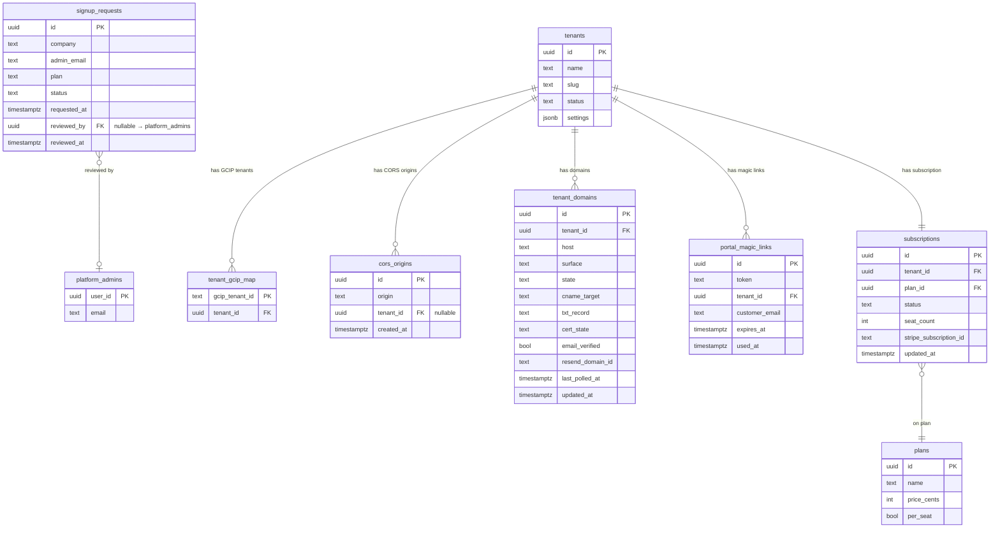

# Ez-Bids — Data / Domain Design Document

**STATUS: DRAFT — derived from consensus-approved plan; pending council + Jon validation.**
Derived from: `ralplan-ezbids-multitenant-DRAFT.md` (Planner→Architect SOUND-WITH-CHANGES→Critic APPROVE, all 7 changes applied) and `docs/superpowers/specs/2026-07-10-ezbids-multitenant-brief.md`.

---

## 1. Existing Tables (Reused, Verified 2026-07-10)

The following tables are the foundation Ez-Bids builds on. They are not net-new.

### 1.1 `tenants` (existing, RLS-forced owner table)

The platform tenant record. Every RLS-enforced table carries a `tenant_id` FK referencing this. The `settings` JSONB column (`app/models.py:44`) holds all per-tenant configuration sub-keys; `core/tenant_settings.py` is the read layer. Ez-Bids extends this column with sub-keys rather than adding new tables where the data is simple and non-pollable.

Key existing fields: `id UUID PK`, `name TEXT`, `slug TEXT UNIQUE`, `status TEXT CHECK IN ('active','past_due','suspended')`, `settings JSONB`.

New sub-keys added by Ez-Bids waves (all under `settings`):

| Sub-key path | Wave | Purpose |
|---|---|---|
| `settings.integrations.wp_url` | W0 | Moved from env; tenant 1 only initially |
| `settings.integrations.yt_owner_channel_id` | W0 | Moved from env; tenant 1 only initially |
| `settings.integrations.workspace_admin_subject` | W0 | Moved from env; tenant 1 only initially |
| `settings.brand.email_html_header` | W3 | Per-tenant email header HTML (was platform_config) |
| `settings.brand.from_name` | W3 | Per-tenant Resend from_name |
| `settings.brand.reply_to` | W3 | Per-tenant reply_to address |
| `settings.email.resend_domain_id` | W3 | Resend domain registration id |
| `settings.email.verified` | W3 | Email domain verification state |
| `settings.email.dkim_records` | W3 | DKIM/SPF records to surface in UI |
| `settings.domains` | W2 | Lightweight domain state cache (source of truth is `tenant_domains`) |

### 1.2 `tenant_gcip_map` (existing, platform-scoped)

Maps GCIP tenant id (the `firebase.tenant` claim in the ID token) to a platform tenant `id`. Used by `_resolve_tenant` (`api/auth.py:51`). No RLS tenant filter — readable by the platform session to perform the resolution before a tenant session is established.

Key fields: `gcip_tenant_id TEXT PK`, `tenant_id UUID FK → tenants(id)`.

### 1.3 `platform_admins` (existing, platform-scoped)

Holds the set of users who have platform-admin authority (Jon, Tim). Checked by `require_internal_tenants` (`api/auth.py:352`). Not RLS-filtered; checked on a platform session before impersonation.

### 1.4 `platform_config` (existing, platform-scoped)

Key-value platform configuration (`app/models.py:212`, `PlatformConfig`). Ez-Bids moves email branding from here to `Tenant.settings.brand` in W3. The `platform_config` table itself remains for genuinely platform-wide settings.

### 1.5 Proposal and customer-facing tables (existing, RLS-forced)

`proposals`, `proposal_events`, `measurements`, `documents`, and the accept-token RLS policy (migration 0022) are all reused directly by the customer portal (W4). The `_token_scoped_session` pattern (`api/routes/proposals.py:93`) is the established seam; magic-link auth (W4) follows the same pattern.

---

## 2. New Tables (Ez-Bids Net-New, W0–W6)

### 2.1 `cors_origins` — W0 (migration 0026)

Replaces the static `CORS_ORIGINS` env tuple. Read at every request by the dynamic CORS middleware.

```sql
CREATE TABLE cors_origins (
    id          UUID PRIMARY KEY DEFAULT gen_random_uuid(),
    origin      TEXT NOT NULL,          -- e.g. https://app.example.com
    tenant_id   UUID REFERENCES tenants(id) ON DELETE CASCADE NULLABLE,
                                        -- NULL = platform-wide origin
    created_at  TIMESTAMPTZ NOT NULL DEFAULT now()
);
CREATE UNIQUE INDEX cors_origins_origin_uidx ON cors_origins(origin);
```

**RLS posture:** platform-scoped table (no tenant GUC filter). The dynamic CORS middleware runs before tenant resolution — it must read from a platform session. RLS policy: readable by platform session; writable only by platform-admin actions. Tenant-scoped origins are inserted automatically by the domain onboarding flow (W2) when a domain reaches `live`, and are deleted by `core/offboard.py`.

**Ownership distinction:** unlike `authorized_domains` (a TF-managed GCIP attribute with a single runtime owner and `ignore_changes`), `cors_origins` is a pure app table with no TF resource attribute — runtime writes are zero-drift by construction.

---

### 2.2 `tenant_domains` — W2 (migration 0027)

Pollable, indexable source of truth for the domain lifecycle state machine. Preferred over storing state in `Tenant.settings.domains` JSONB because per-domain state needs to be queryable (e.g., "find all domains in `cert_pending` older than N hours for the health-check alert").

```sql
CREATE TABLE tenant_domains (
    id              UUID PRIMARY KEY DEFAULT gen_random_uuid(),
    tenant_id       UUID NOT NULL REFERENCES tenants(id) ON DELETE CASCADE,
    host            TEXT NOT NULL,      -- e.g. app.example.com
    surface         TEXT NOT NULL CHECK (surface IN ('app', 'quote')),
    state           TEXT NOT NULL CHECK (state IN (
                        'requested', 'dns_pending', 'cert_pending', 'live', 'failed'
                    )) DEFAULT 'requested',
    cname_target    TEXT,               -- CNAME record value to surface in UI
    txt_record      TEXT,               -- TXT record value to surface in UI
    cert_state      TEXT,               -- raw cert state from Firebase Hosting API
    last_polled_at  TIMESTAMPTZ,
    updated_at      TIMESTAMPTZ NOT NULL DEFAULT now()
);
CREATE UNIQUE INDEX tenant_domains_host_uidx ON tenant_domains(host);
```

**RLS posture:** RLS-FORCED on `tenant_id`. A tenant session can only see and modify their own domain rows. Platform admin can read all via impersonation.

**Email verification fields** (added in W3 or as a W3 migration to this table):

```sql
ALTER TABLE tenant_domains ADD COLUMN email_verified BOOL NOT NULL DEFAULT false;
ALTER TABLE tenant_domains ADD COLUMN resend_domain_id TEXT;
ALTER TABLE tenant_domains ADD COLUMN email_dkim_state TEXT;
```

---

### 2.3 `portal_magic_links` — W4 (migration 0028)

Short-lived single-use tokens granting a customer a session on `quote.{tenantDomain}`. Follows the same RLS-token pattern as the 0022 accept-token policy.

```sql
CREATE TABLE portal_magic_links (
    id              UUID PRIMARY KEY DEFAULT gen_random_uuid(),
    token           TEXT NOT NULL UNIQUE,   -- cryptographically random, URL-safe
    tenant_id       UUID NOT NULL REFERENCES tenants(id) ON DELETE CASCADE,
    customer_email  TEXT NOT NULL,
    expires_at      TIMESTAMPTZ NOT NULL,   -- recommend: now() + interval '15 minutes'
    used_at         TIMESTAMPTZ             -- NULL = unused; set on first successful redeem
);
CREATE INDEX portal_magic_links_token_idx ON portal_magic_links(token);
CREATE INDEX portal_magic_links_tenant_idx ON portal_magic_links(tenant_id);
```

**RLS posture:** RLS-FORCED on `tenant_id`. The token-resolution query runs on a platform session (like `_token_scoped_session` for proposals), immediately stamps a tenant-scoped session, then all subsequent data reads run RLS-enforced. A token for tenant A's customer cannot resolve to tenant B's data.

**Expiry + single-use enforcement:** `expires_at` checked at redeem time; `used_at IS NOT NULL` → reject. Both checks happen in the same transaction that stamps `used_at`.

---

### 2.4 `plans` — W5 (migration 0029)

Billing plan definitions. Seeded with the v1 flat per-seat plan.

```sql
CREATE TABLE plans (
    id          UUID PRIMARY KEY DEFAULT gen_random_uuid(),
    name        TEXT NOT NULL,          -- e.g. 'standard'
    price_cents INT NOT NULL,           -- 4900 = $49.00
    per_seat    BOOL NOT NULL DEFAULT true,
    created_at  TIMESTAMPTZ NOT NULL DEFAULT now()
);
```

**RLS posture:** platform-scoped (no RLS tenant filter). Plans are visible to any authenticated session for display purposes; writable only by platform-admin actions.

---

### 2.5 `subscriptions` — W5 (migration 0029)

One row per tenant. Links to a plan, holds billing status and seat count.

```sql
CREATE TABLE subscriptions (
    id                      UUID PRIMARY KEY DEFAULT gen_random_uuid(),
    tenant_id               UUID NOT NULL UNIQUE REFERENCES tenants(id) ON DELETE CASCADE,
    plan_id                 UUID NOT NULL REFERENCES plans(id),
    status                  TEXT NOT NULL CHECK (status IN ('active', 'past_due', 'suspended'))
                                DEFAULT 'active',
    seat_count              INT NOT NULL DEFAULT 0,  -- updated at invoice time
    stripe_subscription_id  TEXT,                    -- NULL until billing goes live
    updated_at              TIMESTAMPTZ NOT NULL DEFAULT now()
);
```

**RLS posture:** RLS-FORCED on `tenant_id`. Tenant admins can read their own subscription row (for billing panel display). Platform admins can read all. Write path: only the billing webhook handler (W5) and the platform-admin provisioning flow (W6) write to this table.

**Lifecycle integration:** `subscriptions.status` drives the tenant sign-in gate already modeled in `_resolve_tenant` tenant status check. When the billing webhook (W5) marks a tenant `suspended`, the next login attempt for that tenant is blocked.

---

### 2.6 `signup_requests` — W6 (migration 0030)

The request-access queue. One row per prospective tenant signup. Never contains a live `tenant_id` until approved — approval triggers provisioning which creates the `tenants` row.

```sql
CREATE TABLE signup_requests (
    id              UUID PRIMARY KEY DEFAULT gen_random_uuid(),
    company         TEXT NOT NULL,
    admin_email     TEXT NOT NULL,
    plan            TEXT NOT NULL DEFAULT 'standard',
    status          TEXT NOT NULL CHECK (status IN ('pending', 'approved', 'rejected'))
                        DEFAULT 'pending',
    requested_at    TIMESTAMPTZ NOT NULL DEFAULT now(),
    reviewed_by     UUID REFERENCES platform_admins(user_id) NULLABLE,
    reviewed_at     TIMESTAMPTZ NULLABLE
);
```

**RLS posture:** platform-scoped table with NO RLS tenant filter. Visible only to authenticated platform admins (checked via `require_internal_tenants` + `admin_tenants` platform_admin action). Not readable in any tenant session. This table predates tenant creation — it cannot be tenant-scoped.

---

## 3. Domain Lifecycle State Machine

Managed by `core/domain_onboarding.py` (W2). Stored in `tenant_domains.state`. Designed to be **idempotent and resumable** — any transition can be re-driven without side effects.

```
         tenant enters domain
                │
                ▼
          [requested]
                │  sites.create (Firebase Hosting REST)
                │  customDomains add (proven REST path)
                ▼
          [dns_pending] ─────────────────────────────────┐
                │  (surface CNAME + TXT in UI)            │ timeout / cert
                │  poll cert state                         │ provisioning failure
                ▼                                          │
          [cert_pending]                                   │
                │  cert issued                             │
                │  write authorized_domains (GCIP admin API)
                │  insert cors_origins rows (W0 table)     │
                ▼                                          ▼
            [live]                                     [failed]
                                                           │
                                                       resumable:
                                                       re-enter at
                                                       [requested]
```

**Transitions:**

| From | To | Trigger | Side effects |
|---|---|---|---|
| — | `requested` | Admin enters domain in onboarding UI | Create `tenant_domains` row |
| `requested` | `dns_pending` | `sites.create` + `customDomains` REST calls succeed | Store `cname_target`, `txt_record` in row |
| `dns_pending` | `cert_pending` | Firebase Hosting API reports DNS verified | Update `cert_state` |
| `cert_pending` | `live` | Firebase Hosting API reports cert issued | Write `authorized_domains` (GCIP admin API); insert `cors_origins` rows |
| `cert_pending` | `failed` | Timeout threshold exceeded | Alert; mark `failed` |
| `dns_pending` | `failed` | Timeout threshold exceeded | Alert; mark `failed` |
| `failed` | `requested` | Admin retries via onboarding UI | Reset state; re-run |

**Alert:** platform-admin dashboard (W6) surfaces a health panel showing domains stuck in `cert_pending` or `dns_pending` past a configurable threshold.

---

## 4. Tenant Lifecycle State

`tenants.status` (existing column) drives sign-in gating in `_resolve_tenant`. Ez-Bids extends the meaning of each state:

| Status | Sign-in | User invite | Billing |
|---|---|---|---|
| `active` | Allowed | Allowed | Seat count updated at invoice time |
| `past_due` | Allowed (grace period) | Allowed | Payment overdue; Stripe webhook sets this |
| `suspended` | **Blocked** (`_resolve_tenant` rejects) | Blocked | Suspended; admin must intervene |

The billing webhook handler (W5) is the only writer of `subscriptions.status`; a side-effect of a `suspended` subscription status write also updates `tenants.status` (or `_resolve_tenant` reads `subscriptions.status` directly — to be decided at implementation).

---

## 5. Entity Relationship Diagram



---

## 6. RLS Posture Summary

| Table | RLS | Tenant filter | Notes |
|---|---|---|---|
| `tenants` | FORCED | Self-read via `tenant_id = id` | Platform admin reads all via impersonation |
| `tenant_gcip_map` | Platform-scoped | None | Read before tenant resolution; no tenant GUC set |
| `platform_admins` | Platform-scoped | None | Checked before impersonation |
| `platform_config` | Platform-scoped | None | Existing; Ez-Bids reads at middleware level |
| `cors_origins` | Platform-scoped | None | Read before tenant resolution at CORS middleware |
| `tenant_domains` | **RLS-FORCED** | `tenant_id` | Tenant sees only own domains |
| `portal_magic_links` | **RLS-FORCED** | `tenant_id` | Token resolution on platform session; stamped immediately |
| `plans` | Platform-scoped | None | Read-only for display; write = platform-admin only |
| `subscriptions` | **RLS-FORCED** | `tenant_id` | Tenant reads own; write = billing webhook + provisioning |
| `signup_requests` | Platform-scoped | None | Not tenant-scoped (predates tenant creation); platform-admin only |
| All existing 30 tables | **RLS-FORCED** | `tenant_id` | Unchanged; every new path must respect this |

---

## 7. How Ez-Bids Data Maps Onto Existing Structures

| Ez-Bids concern | Storage | Rationale |
|---|---|---|
| Per-tenant integration env vars (WP_URL etc.) | `Tenant.settings.integrations` JSONB sub-key | Moved from env in W0; JSONB avoids a new table for simple key-value data |
| Per-tenant brand / email header | `Tenant.settings.brand` JSONB sub-key | Moved from `platform_config` in W3 |
| Domain lifecycle state | `tenant_domains` table (W2) + `Tenant.settings.domains` cache | Table for pollability + indexing; JSONB for lightweight in-process reads |
| Email identity state | `tenant_domains` columns + `Tenant.settings.email` | Shares domain row for co-located verification UX |
| GCIP per-tenant identity | `tenant_gcip_map` (existing) | Already models the `gcip_tenant_id → platform tenant_id` mapping |
| Customer portal auth | `portal_magic_links` (W4) + existing 0022 accept-token policy | Magic-link for portal sessions; accept-token for direct proposal deep-links |
| Billing / plan | `plans` + `subscriptions` (W5) | New tables; linked to `tenants.status` for sign-in gating |
| Tenant signup queue | `signup_requests` (W6) | Platform-scoped, predates `tenants` row creation |
| CORS management | `cors_origins` (W0) | App-owned table; no TF attribute; zero-drift runtime writes |
| SSO configuration | `tenant_gcip_map` + GCIP tenant IdP config (runtime, via `provision.add_sso_provider`) | No new table; SSO config lives in GCIP; mapping table already exists |
